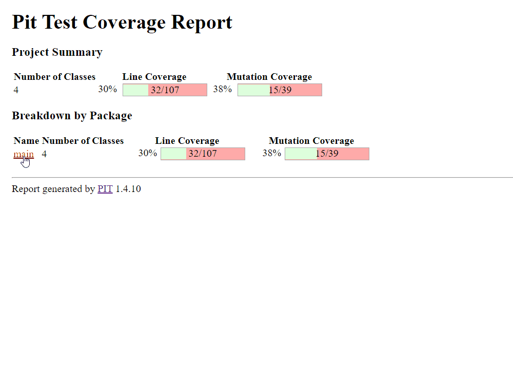
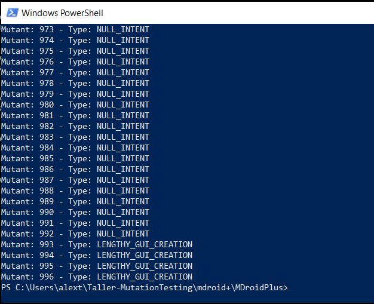
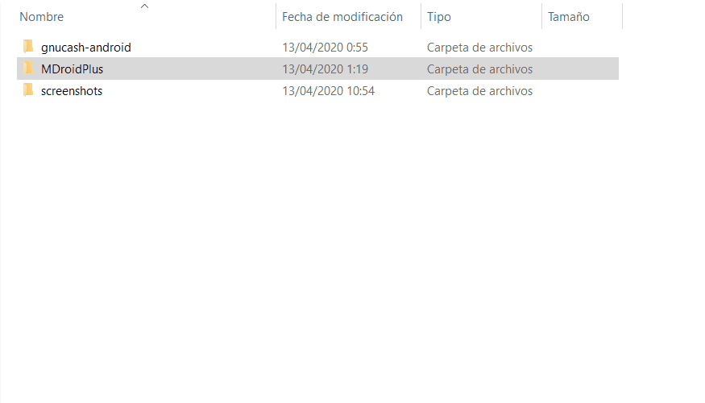

# TALLER MUTATION TESTING

Taller implementado por:
- [x] Javier Alexander Perez Arevalo
    - 201811140
- [x] Juan Sebastian Sosa
    - 201425255

## ENTREGABLE
Enviar un zip que incluya:

* **1. Los reportes generados en el numeral 1**

    #### Evidencia:
    
    * Consola:
    
       
    
    ***
    
    * Reporte generado: [Click aquí](https://htmlpreview.github.io/?https://raw.githubusercontent.com/jssosa10/Taller-MutationTesting/master/pitest/java-to-do/build/reports/pitest/202004122042/index.html)
    
       

* **2. Su reporte escrito del numeral 2.3 diciendo cómo se comportó la suite de pruebas de JUnit de GNUCash y el Monkey de Android con los mutantes** :

    *Usted deberá escoger 10 de los mutantes generados y reemplazar las fuentes de GNUCash por las de los 10 mutantes escogidos. Desde Android Studio deberá correr las pruebas JUnit incluidas en el proyecto para cada uno de los mutantes. Luego, tendrá que hacer un reporte de cuáles mutantes fueron matados y cuáles lograron sobrevivir.*

    *Además, usted deberá compilar las fuentes de los 10 mutantes y luego correr el monkey de Android contra cada una de estas. La idea es que usted compare la ejecución de un mismo monkey sobre los mutantes y la aplicación original. Incluya en su reporte que mutantes fueron matados con el monkey y cuáles sobrevivieron.*
    
    #### Evidencia:
    
    * Comando ejecutado (en Windows) para generar las mutaciones:

       ```java -jar .\target\MDroidPlus-1.0.0.jar .\libs4ast\ ..\gnucash-android\app\src\main\ org.gnucash.android .\tmp\mutants\ .\ false```
    
    ***
    
    * Se generaron 996 mutantes con exito:
    
       
    
       
    
    ***
    
    * **Ver reporte escrito mutantes MDroid+**: [Click aquí](https://github.com/jssosa10/Taller-MutationTesting/wiki/2.-Reporte-escrito-MDroidPlus)

* **3. Los reportes generados en el numeral 3**

    #### Evidencia:
    
    * JSOSA

* **4. Bitacora de uso de MutAPK** :

    *Usted debe seleccionar una de las apps móviles usadas para el proyecto y hacer uso de MutAPK escogiendo 5 operadores y limitando la cantidad de mutantes generados a 50.*

    *El reporte de esta parte del taller consta de una bitacora de uso de MutAPK junto con una evaluación sencilla de los resultados obtenidos, se espera que usted evalue por lo menos la cantidad de APKs que se generaron por operador al finalizar la ejecución de MutAPK.*

    #### Evidencia:
    
    * Bitácora MutAPK: [Click aquí](https://github.com/jssosa10/Taller-MutationTesting/wiki/4.-Bit%C3%A1cora-MutAPK)
